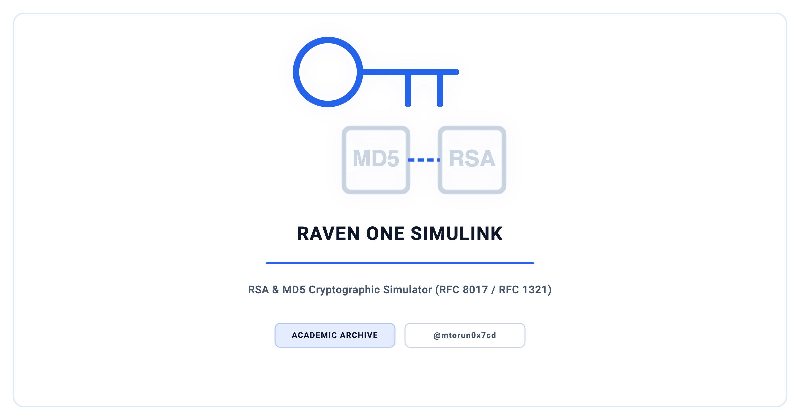
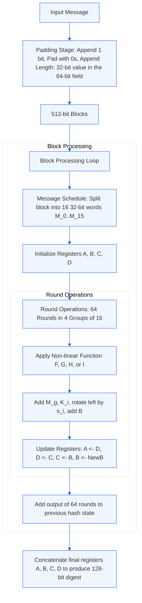
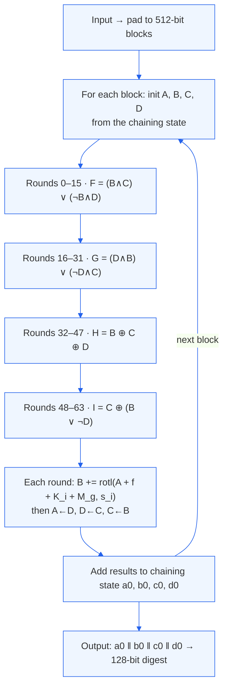

<p align="center">
  <picture>
    <source media="(prefers-color-scheme: dark)" srcset="docs/social_preview_dark.png" />
    <source media="(prefers-color-scheme: light)" srcset="docs/social_preview_light.png" />
    
  </picture>
</p>

# Raven One SimuLink

> Educational RSA and MD5 cryptographic simulator that traces every RSA intermediate step by step and computes MD5 digests with a from-scratch 64-round engine.

[](https://github.com/mtorun0x7cd/raven-one-simulink/actions/workflows/ci.yml)


> **Archived.** A frozen record of completed work, preserved for reference and not actively maintained. See [`SECURITY.md`](SECURITY.md) for scope and disclosures.

---

## Overview

Raven One SimuLink is a C# WinForms desktop application that makes the RSA public-key cryptosystem and the MD5 message-digest algorithm transparent: every RSA intermediate value — from the key parameters through the encryption and decryption operands — is written out for inspection, and each MD5 run shows its input, the ASCII encoding of that input, and the resulting 128-bit digest. It was built as the practical component of the Bachelor thesis *Password- / Keyless authentication* (TH Köln, June 2021), where the author describes it as his "main work of this thesis"; the thesis presents the program in its implementation chapter and reproduces its full source in the appendix. The name *Raven One SimuLink* is the program's original title from that thesis; despite the "SimuLink" spelling, it has no connection to MATLAB/Simulink.

The program is a pedagogical instrument, not a production cryptographic tool. Both algorithms are implemented from scratch — without any cryptographic library — following the definitions in RFC 8017 (RSA) [1] and RFC 1321 (MD5) [2]. RSA runs on small fixed demo primes (p = 11, q = 17) so that each step stays legible by hand: parameters are held in `System.Numerics.BigInteger`, the public exponent `e` is the smallest integer greater than two that is coprime to φ(n), and the private exponent is taken from the closed form `d = (1 + 2·φ(n)) / e`, which yields the modular inverse `e⁻¹ mod φ(n)` for these parameters. MD5 is a complete 64-round Merkle–Damgård [3], [4] construction with the sine-derived K constants and the per-round shift schedule.

A digest-validation workflow compares two MD5 digests side by side, illustrating the integrity check that underlies digital-signature verification.

## Context

| Dimension | Detail |
| :--- | :--- |
| **Institution** | TH Köln (Cologne University of Applied Sciences) — Institut für Nachrichtentechnik (INT) |
| **Program** | Computer Science & Engineering (Technische Informatik), B.Sc. |
| **Thesis** | *Password- / Keyless authentication* (June 2021) — Raven One SimuLink is its practical cryptographic component (Chapter 5; source in the appendix), thesis graded *sehr gut* (excellent) |
| **First reviewer** | Prof. Dr. Michael Silverberg (TH Köln) |
| **Second reviewer** | Frank Mördel (Jamestown US-Immobilien GmbH) |
| **Semester** | Summer 2021 |
| **Type** | Individual |
| **ePublications** | Thesis to be archived in TH Köln's [institutional repository](https://epb.bibl.th-koeln.de/); persistent URN/DOI added once assigned |

## Features

- **RSA Key Parameters** — displays the primes p, q, the modulus n = p·q, the Euler totient φ(n) = (p−1)(q−1), the public exponent e, and the private exponent d for the fixed demo primes
- **RSA Encryption / Decryption** — computes c = mᵉ mod n and m = cᵈ mod n, logging the operands of each step
- **Custom MD5 Hashing** — from-scratch 64-round Merkle–Damgård digest per RFC 1321
- **Digest Validation** — side-by-side comparison of two MD5 digests, the integrity check behind digital-signature verification
- **Transparent Computation** — every intermediate value (keys, digests, ASCII codes, operands) is written to the detail panel for step-by-step study

## Architecture

The source preserved here is the listing from the thesis appendix: the two cryptographic engines, the GUI controller, and the application entry point.

| File | Class | Responsibility |
| ------ | ------- | ---------------- |
| `Program.cs` | `Program`, `Form1` (partial) | WinForms entry point (`Main`) and the auxiliary `RSA` / `MD5` / `About` form stubs |
| `Raven One.cs` | `Form1` (partial) | Main GUI controller — drives the encrypt, decrypt, hash, and validate actions and renders intermediate values |
| `cRSA.cs` | `cRSA` | RSA engine — Euclidean GCD, key derivation, modular exponentiation over `BigInteger` |
| `cMD5.cs` | `cMD5` | MD5 engine — 64-round computation with per-round shift tables and sine-derived constants |

> The thesis appendix lists these source classes only; the WinForms designer layout is not part of that listing, so a fresh build compiles the algorithm logic and hosts it in a minimal window. The original application as it ran in 2021 is documented with screenshots in the thesis (Chapter 5).

### MD5 Cryptographic Dataflow Diagram



<details>
  <summary>MD5 Execution Trace for "admin"</summary>
  <ul>
    <li><strong>Input string:</strong> <code>admin</code></li>
    <li><strong>Padded block (hex):</strong><br>
      <code>61646d696e8000000000000000000000000000000000000000000000000000000000000000000000000000000000000000000000000000002800000000000000</code>
    </li>
    <li><strong>Initial register states:</strong><br>
      <code>A = 0x67452301</code><br>
      <code>B = 0xefcdab89</code><br>
      <code>C = 0x98badcfe</code><br>
      <code>D = 0x10325476</code>
    </li>
    <li><strong>Register states after round 0:</strong><br>
      <code>A = 0x10325476</code><br>
      <code>B = 0x5bd217a9</code><br>
      <code>C = 0xefcdab89</code><br>
      <code>D = 0x98badcfe</code>
    </li>
    <li><strong>Final MD5 digest:</strong> <code>21232f297a57a5a743894a0e4a801fc3</code></li>
  </ul>
</details>

### RSA Key Generation Flow

```text
1. Fixed demo primes      p = 11, q = 17  (constants, chosen for legibility)
2. Compute modulus        n = p × q
3. Compute Euler totient  φ(n) = (p − 1)(q − 1)
4. Public exponent        e = smallest integer > 2 with gcd(e, φ(n)) = 1
5. Private exponent       d = (1 + 2·φ(n)) / e   ( = e⁻¹ mod φ(n) for these parameters )
6. Encrypt                c = mᵉ mod n
7. Decrypt                m = cᵈ mod n
```

### MD5 Round Structure (Merkle–Damgård)



## Tech Stack

| Category | Technologies |
| ---------- | ------------- |
| Language | C# — targets .NET 8 (`net8.0-windows`); originally authored on .NET Framework 4.7.2 |
| UI Framework | Windows Forms (WinForms) |
| Arithmetic | `System.Numerics.BigInteger` for arbitrary-precision RSA operations |
| References | RFC 8017 (RSA), RFC 1321 (MD5) |

## Project Structure

```text
raven-one-simulink/
├── src/                       # Source code (as listed in the thesis appendix)
│   ├── Program.cs             # WinForms entry point and form stubs
│   ├── Raven One.cs           # Main GUI controller (Form1)
│   ├── cRSA.cs                # RSA engine
│   └── cMD5.cs                # MD5 engine
├── docs/                      # Documentation
│   ├── Bachelor Thesis.pdf    # Thesis "Password-/Keyless authentication" (presents this software in Ch. 5 + appendix)
│   ├── Handout.pdf            # Colloquium handout
│   ├── social_preview.svg     # Master source that render.sh flattens into the served PNGs
│   ├── social_preview_light.png  # Light-theme header, rendered from the SVG
│   ├── social_preview_dark.png   # Dark-theme header, rendered from the SVG
│   ├── social_card.png        # Social-media preview card
│   └── render.sh              # Flattens the SVG master into the served PNGs
├── RavenOneSimuLink.csproj    # .NET 8 project file
├── LICENSE                    # MIT License
└── README.md
```

## Getting Started

### Prerequisites

- .NET 8 SDK
- Windows to run the application (WinForms); it builds on macOS and Linux as well, since the project sets `EnableWindowsTargeting`

### Build & Run

```bash
git clone https://github.com/mtorun0x7cd/raven-one-simulink.git
cd raven-one-simulink

dotnet build -c Release   # compiles on Windows, macOS, or Linux
dotnet run                # run on Windows
```

The project is configured for cross-platform compilation; executing the WinForms application requires Windows.

## Documentation

| Document | Description |
| --- | --- |
| [Bachelor Thesis.pdf](docs/Bachelor%20Thesis.pdf) | Full thesis, *Password-/Keyless authentication*; Raven One SimuLink is presented in Chapter 5 and its source reproduced in the appendix |
| [Handout.pdf](docs/Handout.pdf) | Colloquium handout summarizing the thesis |

## References

[1] K. Moriarty et al., "PKCS #1: RSA Cryptography Specifications Version 2.2," RFC 8017, 2016. [RFC 8017](https://www.rfc-editor.org/rfc/rfc8017)

[2] R. Rivest, "The MD5 Message-Digest Algorithm," RFC 1321, 1992. [RFC 1321](https://www.rfc-editor.org/rfc/rfc1321)

[3] R. Merkle, "A Certified Digital Signature," *Advances in Cryptology — CRYPTO '89*, 1989.

[4] I. Damgård, "A Design Principle for Hash Functions," *Advances in Cryptology — CRYPTO '89*, 1989.

## Citation

Citation metadata is provided in [`CITATION.cff`](CITATION.cff); GitHub renders a *Cite this repository* action from it.

## Security

This is an archived, educational project and is not actively maintained. Its cryptography is intentionally insecure — MD5 is broken and the RSA implementation uses fixed, trivially small primes with no padding. See [`SECURITY.md`](SECURITY.md) for details.

## License

This project is licensed under the [MIT License](LICENSE). It was originally released under GPL-3.0-or-later as the 2021 B.Sc. thesis submission and has since been relicensed to MIT by the author, the sole copyright holder; see [`NOTICE`](NOTICE). The MIT License governs.

## Author

**Mert Torun, M.Sc.** — IT Security Architect · Systems Engineer  
mtorun0x7cd · Research & Development

His work spans the verification and validation of safety-critical systems, infrastructure hardening, and cryptographic integrity, grounded in an M.Sc. in Computer Science & Engineering from TH Köln. This repository is preserved as a record of a completed project rather than maintained as a living tool.

- **Email**: [info@mtorun0x7cd.com](mailto:info@mtorun0x7cd.com)
- **Website**: [mtorun0x7cd.com](https://mtorun0x7cd.com)
- **LinkedIn**: [linkedin.com/in/mtorun0x7cd](https://www.linkedin.com/in/mtorun0x7cd)
- **GitHub**: [github.com/mtorun0x7cd](https://github.com/mtorun0x7cd)
